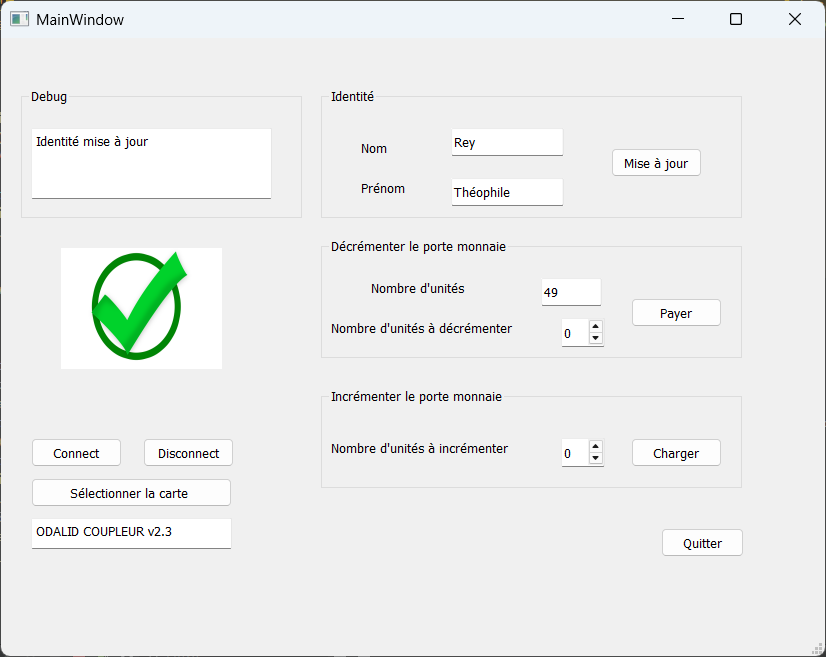

# TP Communication Sans Fil – Carte MIFARE Classic

**Polytech Dijon – 4A**  
**Auteurs :**  
- Théophile Rey (4A Cyber)  
- Paul Ducolomb (4A IoT)

---

## Objectif

Ce projet consiste à développer une application capable d'interagir avec une carte sans contact MIFARE Classic dans un contexte multiservices (identité étudiante, compteur d’unités, etc.).  
L'application repose sur une interface graphique construite avec Qt (compilateur MinGW) et un lecteur connecté en USB, via une bibliothèque dynamique fournie.

---

## Fonctionnalités

- Lecture et écriture de blocs mémoire sur la carte  
- Authentification par clés A/B selon le type d’opération  
- Incrémentation et décrémentation automatique d’un compteur  
- Affichage, modification et enregistrement de l'identité (nom, prénom)  
- Interface graphique avec retour visuel (icônes) et sonore (buzzer)  

---

## Gestion des clés

L'authentification se fera avec les clés suivantes :
- pour la lecture et la décrémentation nous utiliserons la clé A situé dans le Secure Element du lecteur (coffre fort) à l’index 3
- pour l’écriture et l’incrémentation nous utiliserons la clé B situé dans le Secure Element du lecteur (coffre fort) à l’index 3

---

## Interface graphique

L’application Qt propose une interface simple et intuitive permettant :

- Connexion et déconnexion du lecteur  
- Affichage des informations stockées sur la carte  
- Modification du nom et prénom via des champs de texte  
- Boutons dédiés pour incrémenter ou décrémenter le compteur  
- Messages de retour affichés directement dans l’interface  
- Signal visuel (icône verte ou rouge) + buzzer en cas de succès ou d’échec  

---

## Comportement logiciel

- À la connexion, le lecteur est initialisé, sa version affichée, et la carte est reconnue  
- L'utilisateur peut modifier les champs texte, puis cliquer sur “Mise à jour” pour réécrire les blocs mémoire correspondants  
- Lors d’une incrémentation ou d’une décrémentation, la carte gère directement les opérations grâce à son format VALUE  
- En cas d’échec (carte absente, mauvaise authentification…), l’interface affiche un message d’erreur et active le buzzer avec une LED rouge  

---

## Compilation du projet

- Ouvrir le fichier `myapp.pro` avec Qt Creator  
- Compiler en mode Release avec MinGW  
- Placer la DLL du lecteur dans le même dossier que l’exécutable généré  

---

## Aperçu

